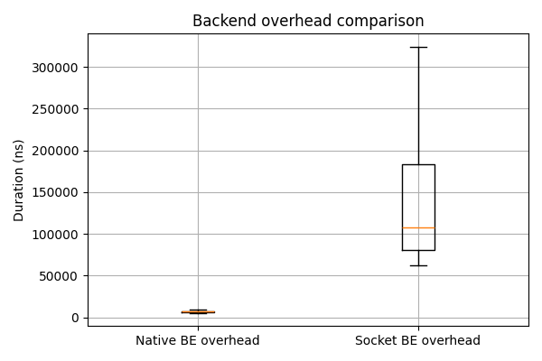
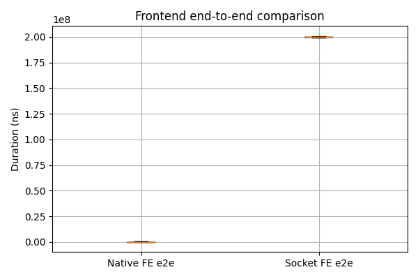

# Measurements

It has been done a comparison between using Sockets and Native compilation in order to let Collektive interact with Unity. In the following it will be explained the results and how to achieve them.

> `data` folder contains `csv`s that lists timings for each comparison.

## Notation

Each file in the `data` folder contains 3 columns:

- `t_ns`: the time in nano seconds in which the timer for that metric has been started (the 0 is equal to 1/1/1970)
- `id`: the name of the metric that it is being measured
- `duration_ns`: the measured duration of that metric

### Ids

Each id has a special meaning. In particular:

- in back-end (i.e. native.csv and socket.csv)
  - `step\.service`: the whole computation, from the very begin when the step request is received to the very end when the step computation is sent
  - `step\.compute`: the core algorithm
- in front-end (i.e. unity_native.csv and unity_socket.csv)
  - `step\.unity\.e2e`: the time taken from for the entire computation, front-end included.
  - in native
    - `step\.native\.call`: time taken to receive answer from back-end
    - `step\.native\.parse`: time taken to covert the basic data into usable data inside Unity
  - in socket
    - `step\.socket\.send`: time spent on the Unity side to serialize and write a step request to the TCP stream.
    - `step\.socket\.parse`: time spent parsing the back-end response JSON into Unity-side data structures
    - `step\.socket\.wait`: time elapsed between sending a step request from Unity and receiving the corresponding response from the back-end.
    - `step\.unity\.apply`: time spent applying the received state to Unity’s internal data structures (values and links).

## Sanity checks

At the very begin it is mandatory to spot invalid data.

- Any row that has `t_ns` or `duration_ns` are less than 0 has been discarded.
- Any row belonging to warm-up sample has been discarded. Warm-up relates to caching, JIT, first allocations and connection setup.

> A warm-up window of 30 samples was discarded, as it empirically captures effects related to caching, initial allocations, JIT compilation, and connection establishment.

## Statistical Analysis

The following statistics has been done over every group of data.

- sample count (i.e. cardinality)
- median
- mean
- tail latencies (95th and 99th percentiles)
- standard deviation

## Overheads

From what computed above we can extract the overhead to finally compare approaches.

### Overhead in back-end

```math
overhead_k = service_k - compute_k
```

It has been done the same statistical analysis over the same values.

### End to end cost

```math
cost_k = e2e_k
```

## Performance Result Summary

The experimental results highlight a significant performance gap between the native integration and the socket-based integration.

On the back-end, the native approach exhibits a median overhead of approximately **7.6 µs**, while the socket-based solution reaches a median overhead of about **230 µs**. This corresponds to a slowdown of roughly **30×** at the median, increasing to over **90×** at the 99th percentile. These results indicate that socket-based inter-process communication introduces substantial and highly variable overhead compared to in-process native calls.

On the front-end end-to-end measurements, the difference is even more pronounced. The native solution shows a median latency of approximately **0.59 ms**, whereas the socket-based approach reaches around **200 ms**. This results in a slowdown of about **337×** at the median, exceeding **600×** at the 95th percentile and approaching **900×** at the 99th percentile. This confirms that communication costs dominate the overall latency when sockets are used in a step-driven execution model.

Overall, the measurements quantitatively demonstrate that native integration is orders of magnitude more efficient and more stable than a socket-based approach for fine-grained interactions.

## Visual Analysis

### Back-end Overhead Distribution



### Front-end Ent-to-End Latency Distribution



